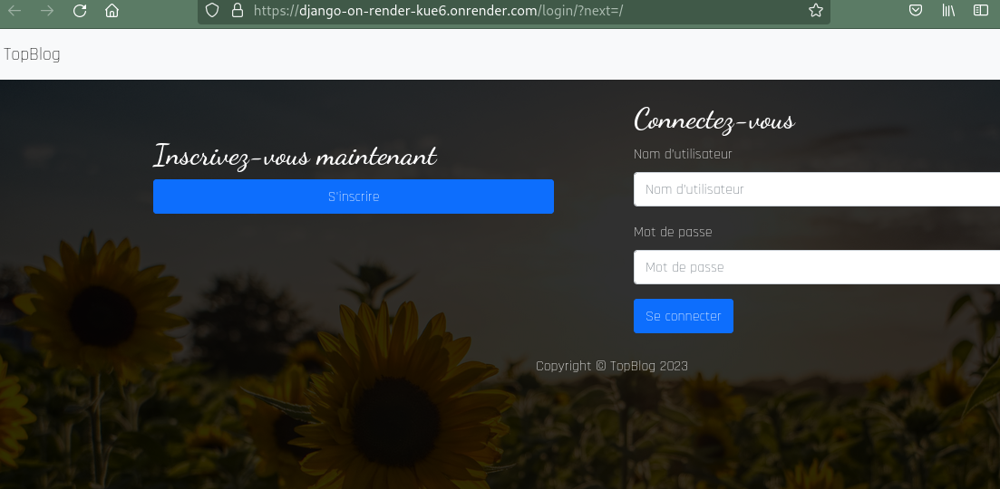

# Deploy Django on Render

## Project description
Last update: **2023/09/06**

Learning and training purposes.

We dynamically deploy a dummy Django application on [Render](https://render.com/).

First objective is to be able to deploy a Django application on Render: have a basic usage of the postgresql database, check the static files collect.

An upload feature should be implemented.

Finally it can be use through Gitlab for CI/CD trainings.

## Documentation

Official docs:

[Render tutorial](https://render.com/docs/deploy-django)

[Render blueprint specifications](https://render.com/docs/blueprint-spec)

Related issues which helped:

[Render support](https://community.render.com/t/update-poetry-to-1-2-0/7957/19)

[Render support](https://community.render.com/t/error-with-poetry-install/11778)

Other sources which helped:

[testdriven.io](https://testdriven.io/blog/django-render/)

## Ressources

Background image from unsplash: https://unsplash.com/photos/8bEMXJ_NwF4

Miniatures images from picum: https://picsum.photos/

---

## Project setup

Use the "render.yaml" file to declare any variables (no .env, .envrc etc usage).

Create a new Blueprint Instance from render.com. And authorize access to your repo.

Compare to official tutorial, you should only notice that :

- **poetry**:

  We use the latest postgresql driver psycopg 3.

  The cache is store within project (so ".cache" is set in .gitignore)

- **build.sh**: a python venv is created, sourced

- **render.yaml**:

  You must set the same region for database and web service. Notice we set **plan: free**.

  After the python venv has been sourced, the startCommand had to be set like this:

      startCommand: "./venv/bin/python -m gunicorn -b :8000 django_on_render.wsgi:application"

- **settings.py**:

  The DEBUG variable is explicitly set to False.

  Check if timezone settings are the ones you need.

---
